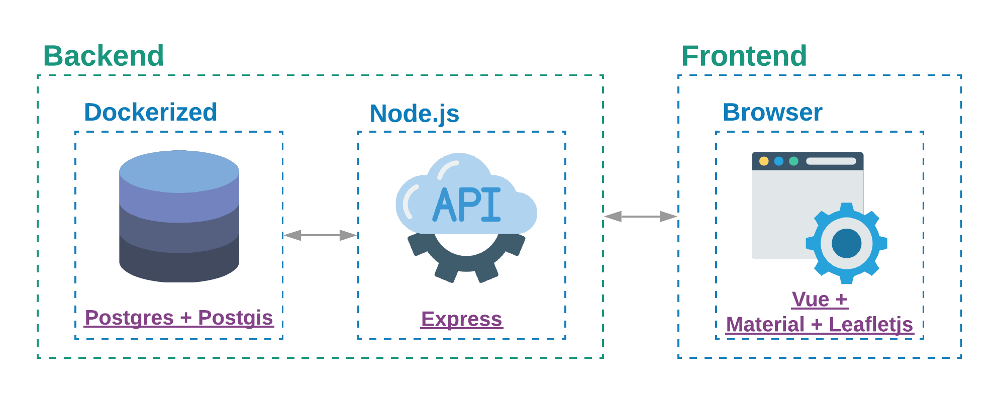

# GIS - Vacation Planner
School Project for GIS Lecture


# Architecture



# Development

Start Database:
```Bash
cd ./src/server
docker-compose up
```
Start Server:
```Bash
cd ./src/server
npm run dev
```
Start Client:
```Bash
cd ./src/client
npm run serve
```

# References

Leaflet + Nodejs + Postgis Example: http://duspviz.mit.edu/web-map-workshop/leaflet_nodejs_postgis/

Leaflet Colorization Example: https://leafletjs.com/examples/choropleth/
